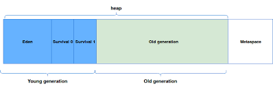
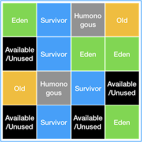
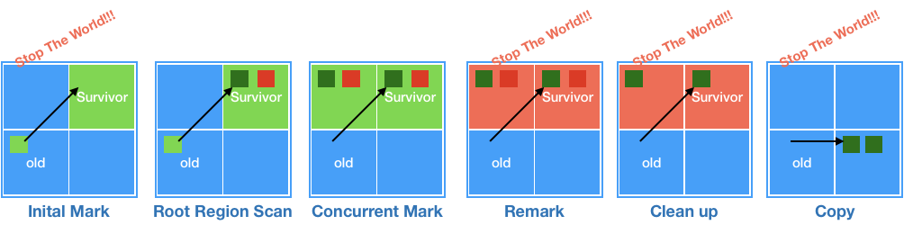
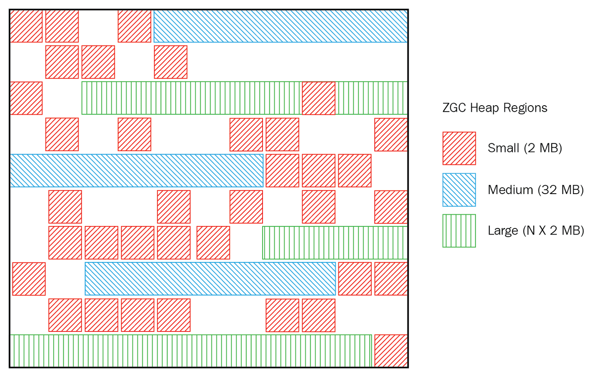
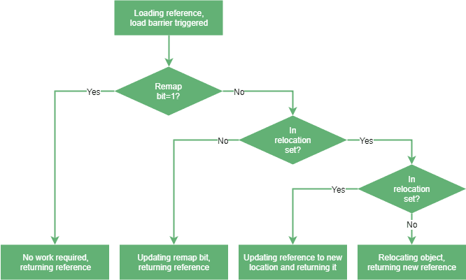
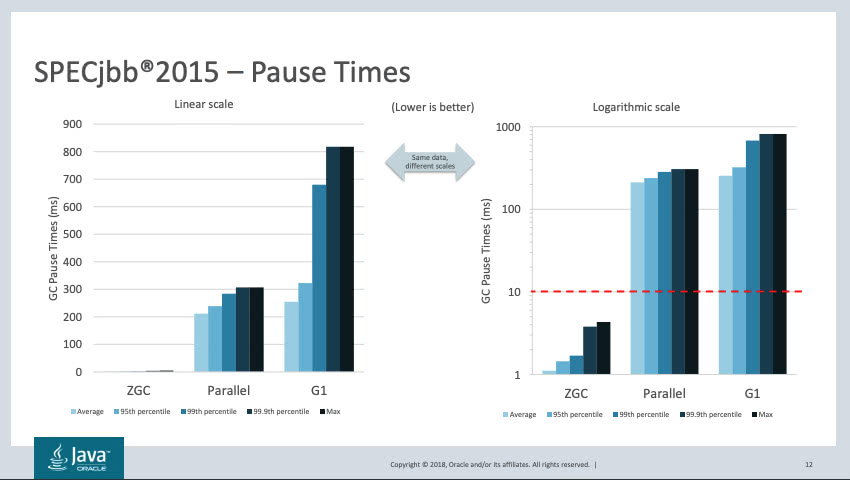

# Java Memory Garbage Collection
 자바 개발자라면 꼭 알고 넘어가야 하는 기본 아닌 기본 소양 📝
## 목차
- [Java Memory Garbage Collection](#java-memory-garbage-collection)
  - [목차](#목차)
  - [JVM](#jvm)
  - [Garbage Collection](#garbage-collection)
  - [G1GC](#g1gc)
    - [튜닝 포인트](#튜닝-포인트)
  - [New Feature(...)](#new-feature)
    - [ZGC](#zgc)
    - [성능비교](#성능비교)
  - [마치면서](#마치면서)
  - [참고](#참고)

## JVM
처음부터 다 설명하는 것은 제가 이야기하고자 하는 포인트가 아니라서,  
간략하게 중요한 것만 짚고 넘어가려고 합니다 ㅎㅎ   
전체적인 JVM 의 구조는 아래와 같습니다

<div>
    
</div>

정확히는 **JVM** 의 `Heap` 에 대해서만 짚고 넘어가보도록 할게요  
저희는 예전부터 개발을 진행해왔고, 많이들 익숙하신 그림을 하나 소개할까해요 

<div>
    
</div>

위 그림은 `Jdk 1.7` 버젼 이전의 Heap 메모리 구조입니다   
* Eden: 새로 생성한 대부분의 객체가 위치하는 곳
* S0, S1: Eden 영역에서 GC가 한번 발생한 후 살아남은 객체들이 존재하는 곳
* Old Memory: Young Generation에 대한 GC가 반복되는 과정속에 살아남은 객체가 살아남는 곳 
  > 특정 회수 이상 참조되어 Old 영역으로 가기 위한 Age를 달성하였을 때 이동하게 된다.
* Perm: Class / Method 의 Meta 정보, static 변수 / 상수들이 저장되는 곳

우리가 아는(흔히 인터넷에 널려있는) Garbage Collection 🚯 도  
위와 같은 가정을 두고 언급한 것들이 정말 많습니다  
<br>
*하지만 지금도 정말 그럴까요?* 
<br>

<div>
    
</div>

정확히는 `Perm` 영역이 `Metaspace` 로 바뀌었습니다  
어떠한 부분들이 더 바뀌었을까요? 

| 구분        | Perm                                          | MetaSpace                                  |
| ----------- | --------------------------------------------- | ------------------------------------------ |
| 저장 정보   | 클래스 meta / 메소드 meta / static 변수, 상수 | 클래스 meta / 메소드 meta                  |
| 관리 포인트 | Heap 영역 튜닝 + Perm 영역 별도               | Native 영역 동적 조정                      |
| GC          | Full GC                                       | Full GC                                    |
| 메모리 측면 | -XX: PermSize / -XX: MaxPermSize              | -XX: MetaSpaceSize / -XX: MaxMetaspaceSize |

가장 중요한 핵심은 `Perm` 영역이 **Heap** 이 아니라 **Native** 영역으로 바뀌었다는 건데요  
**Native** 영역의 가장 큰 특징 중의 하나는  
**Native** 영역은 JVM에 의해서 크기가 강제되지 않고, **프로세스가 이용할 수 있는 메모리 자원을 최대로 활용** 할 수 있습니다  
만일 메모리 leak이 Classloader 을 동작하는 코드에 발생하는 것으로 의심된다면, 이는 최대 메모리를 설정하지 않았기 때문이죠  
<br>
어쨌든 저는 JVM 을 이야기 하고 싶은건 아니고, Heap 이 이렇다 라는 것을 얘기하고 싶었습니다 ㅎㅎ  
그러니 짚어야할 부분만 짚고 넘어가도록 할게요  
<br>
그래서 도대체 GC는 어떻게 되는걸까요?
## Garbage Collection
Garbage Collection이란?
```text
쉽게 말하면,
객체가 접근 불가능한 상태(Unreachable)가 되면, 메모리가 누적되므로 이를 수거하는 작업
GC를 실행하는 쓰레드를 제외한 나머지 쓰레드는 모두 작업을 멈춘다 = stop the world
```
그래서 대게 우리가 알고 있는 GC 튜닝이란, 이 `stop the world` 시간을 줄이는 것입니다  
<br>
Heap 영역은 크게 2가지로 구성이 되어 있는데요, 
1. Young Generation 영역: 대부분의 객체가 GC 되는 영역, 이 영역에서 객체가 사라질 때 **Minor GC** 가 발생
2. Old Generation 영역: Young 영역보다 크게 할당되지만, GC는 적게 발생. 이때는 **Full GC** 라고 일컫음
그렇기 때문에 **Full GC** 는 이 `stop the world` 시간이 길 수 밖에 없습니다 
기본적으로 메모리가 크고, 처리해야 될 양이 많기 때문이죠 
이 old 영역에 대한 GC를 다르게 하기 위해서 많은 알고리즘들이 존재하는데요 
* Serial GC: Heap의 앞부분부터 확인하여 살아있는 것만 남기고(Sweep), 객체들이 연속되도록 Compaction 하는 작업
  > 기본적으로 Mark-Sweep-Compaction 알고리즘에 해당  
  > Serial GC는 적은 메모리와 CPU 코어 개수가 적을 때 가장 올바름 (싱글 쓰레드)
* Parallel GC: Serial GC의 멀티쓰레드 버젼
* Parallel Old GC: Parallel GC와 다른점은 `Mark-Summary-Compaction` 단계를 거쳐서 객체를 식별
  > Summary 에 해당하는 작업이 GC를 수행한 영역에 대해서 살아있는 객체를 식별한다는 작업
* Concurrent Mark & Sweep GC = CMS GC: CMS GC는 다른 GC와는 다르게 `Compaction` 을 진행하지는 않는다
  > 1. Initial Mark: 클래스 로더에서 가장 가까운 객체중 살아 있는 객체만 찾는다
  > 2. Concurrent Mark: 위에서 살아있다고 확인한 객체에서 참조되고 있는 객체를 확인한다
  > 3. Remark: 위 단계에서 새로 추가되거나 참조가 끊긴 객체를 확인한다
  > 4. Concurrent Sweep: 쓰레기를 정리한다
* G1(Garbage First) GC

`G1GC` 는 설명이 따로 없는데요  
사실 오늘은 가장 많이 쓰이고 있는 `G1GC` 와 앞으로 개발될 `새로운 GC` 를 언급하기 위해서 여기까지 왔습니다 😄 

## G1GC
G1GC는 매커니즘이 많이 다릅니다  
위에서 언급한 `Young` 영역과 `Old` 영역에 대한 GC는 잠시 잊는게 좋습니다  
G1GC는 `jdk11` 부터 공식적인 GC 알고리즘으로 적용되었고, 하드웨어가 점점 발전하면서 
대용량 메모리에 적합한 솔루션을 제공하기 위해 나타났습니다  
<br>
G1GC는
```text
앞서 언급했던 Eden, Survivor, Old 영역이 존재하지만, 해당 영역은 고정된 크기가 아니며
전체 Heap 메모리 영역을 Region 이라는 특정한 크기로 나눈 것이고
Region의 상태에 따라 그 Region의 역할(Eden, Survivor, Old)가 동적으로 변동합니다
Region은 기본적으로 ( 전체 Heap 메모리 ) / 2048 로 default 값이 지정되어 있습니다.
```
아마도 이러한 설명을 그림으로 나타내면 아래와 같겠죠 

<div>
    
</div>

앗, 새롭게 보이는 `영역` 들이 존재하네요 ㅎㅎ  
* Humonogous: Region 크기의 50%를 초과하는 큰 객체를 저장하기 위한 공간
* Available/Unused: 아직 사용되지 않은 Region

`G1GC` 에서도 마찬가지로 **Minor GC** 가 존재하며, 요 과정에는 살아남은 객체들을 Survivor Region으로 옮기고, Eden에 대한 영역을 사용가능한(Availabe)Region으로 돌리는 형태로 과정이 일어나게 됩니다  
반면 `G1GC` 에는 **Full GC** 와 유사한 **Concurrent Cycle** 이라는 과정이 존재하는데요,  
해당 과정은 `IHOP(InitiatingHeapOccupancyPercent)` 에서 정한 수치를 초과하면 실행하게 됩니다 

<div>
    
</div>

1. **Initial Mark** : Old Region에 존재하는 객체들이 참조하는 Survivor Region을 찾는다(STW)
2. **Root Region Scan** : 위에서 찾은 Survivor 객체들에 대한 스캔 작업을 실시한다
3. **Concurrent Mark** : 전체 Heap의 scan 작업을 실시하고, GC 대상 객체가 발견되지 않은 Region은 이후 단계를 제외한다
4. **Remark** : 애플리케이션을 멈추고(STW) 최종적으로 GC 대상에서 제외할 객체를 식별한다
5. **Cleanup** : 애플리케이션을 멈추고(STW) 살아있는 객체가 가장 적은 Region에 대한 미사용 객체를 제거한다
6. **Copy** : GC 대상의 Region이었지만, Cleanup 과정에서 완전히 비워지지 않은 Region의 살아남은 객체들을 새로운 Region(Available/Unused) Region에복사하여 Compaction을 수행한다
7. 살아있는 객체가 아주 적은 Old 영역에 대해 [GC pause(mixed)] 를 로그로 표시하고, Young GC가 이루어질 때 수집되도록 한다

### 튜닝 포인트
흠 🤔 동작원리는 알았는데, 도대체 뭘 바꿔야 하죠?  
우선은 무엇인가를 바꾸기 전에 항상  
**성능테스트** + **로그 옵션** 을 켜야 합니다  
`-Xlog:gc*:gc.log` 옵션으로 로그를 활성화해서 파일로 옮기는 것도 하면 좋겠네요.!  
튜닝을 한다는 목적은 GC 에 걸리는 시간을 최소화하는 목적으로 해주시면 좋을 것 같습니다  
* `-XX: InitiatingHeapOccupancyPercent` : IHOP 퍼센트 조절(Marking에 해당하는 최저 임계치)
* `-XX: G1HeapRegionSize` : Region 영역당 하나의 사이즈 (default는 (최대 heap) / 2048)
* `-XX:G1ReservePercent=10` : 공간 overflow의 위험을 줄이기 위해 항상 여유 공간을 유지할 예비 메모리(백분율)
* `-XX:G1HeapWastePercent=10` : 낭비할 Heap 의 공간에 대한 백분율
* 사실 그 외에도 엄~~청 많습니다. 필요한 것은 그때 그때 찾아서 하면 좋겠네요

```text
하지만, 언제까지나 GC 튜닝은 정말 모든 것을 다해보고 마지막에 하는 최종방안임을
꼭 잊지 말아주셨으면 합니다
```
현재 **JDK 11** 의 Default GC 알고리즘으로 별다른 옵션을 주지 않으면   
`G1GC` 를 사용하게 되는데요..  
더 놀라운 것은 앞으로 나올 GC 가 **JDK** 의 버젼업과 함께 준비중에 있다는 사실입니다

## New Feature(...)
그래서 현재 지금 계속 개발되고 있는 GC 알고리즘이 무엇이냐면 ❓  
바로 ZGC 입니다  
### ZGC
`ZGC` 는 **JDK 15버젼에서 바로 Production Ready** 상태인데요,    
조금 더 큰 메모리(8MB ~ 16TB) 에서 효율적으로 Garbage Collect 하기 위한 알고리즘    
개발자가 이야기하기를 
```text
ZGC doesn't get rid of stop-the-world pauses completely.
The collector needs pauses when starting marking, ending marking and starting relocation.
But this pauses are usually quite short - only a few milliseconds.

적은 메모리나 큰 메모리에서 STW 시간을 최대한 적게(10ms 이하로) 가져가기 위해 제작되었다
```
라고 합니다.! 
실제로 `STW` 시간을 줄이기 위해서 Marking 시간에만 `STW` 을 가져가도록 하고 있어요  
`G1GC` 와는 메모리 구조가 되게 유사한데요

<div>
    
</div>

되게 신기하죠?  
각각의 Region을 되게 간단한 구조로 가져갔음을 볼 수 있어요  
`ZGC` 의 핵심은 바로 **Colored pointers** 와 **Load barriers** 라는 주요한 2가지 알고리즘이 존재하는데요  

<div>
    
</div>

객체를 가리키는 변수의 포인터에서 64bit 을 활용해가지고, Marking을 한 것을 볼 수 있어요 
* Finalizable: finalizer을 통해서만 참조되는 Object의 Garbage
* Remapped: 재배치 여부를 판단하는 Mark
* Marked 1 / 0 : Live Object

그렇기 때문에 ZGC는 반드시 64bit 운영체제에서만 사용가능합니다  

<div>
    
</div>

다음은 **Load Barriers** 인데요,  
`ZGC` 는 `G1GC` 와는 다르게 메모리를 재배치하는 과정에 **STW** 없이 재배치를 합니다  
위에서 언급한 bit 를 바탕으로요.!  
이때 RemapMark와 RellocationSet을 확인하면서 참조와 Mark를 업데이트하게 됩니다.!  
그래서 ZGC는 아래와 같은 Flow를 따르게 됩니다 
1. Mark Start `STW` : ZGC의 Root에서 가리키는 객체 Mark 표시
2. Concurrent Mark/Remap: 객체의 참조를 탐색하면서 모든 객체에 Mark 표시
3. Mark End `STW` : 새롭게 들어온 객체들에 대해 Mark 표시
4. Concurrent Pereare for Relocate: 재배치하려는 영역을 찾아 Relocation Set에 배치
5. Relocate Start `STW` : 모든 Root 참조의 재배치를 진행하고 업데이트
6. Concurrent Relocate: 이후 **Load Barriers** 를 사용하여 모든 객체를 재배치 및 참조 수정

<br>

`G1GC` 와의 차이점은, 바로 Pointer를 이용해서 객체를 Marking하고 관리하는 것이 핵심이라고 볼 수 있겠네요!  
개발자분 말씀으로는 **어떠한 Heap 메모리 사이즈가 와도**    
각각의 `STW` 시간을 (<10ms) 이하로 줄이는 것이 `ZGC` 의 **궁극적인 목표** 라고 합니다

### 성능비교

`ZGC` 는 위에 설명에서도 아시겠지만, 큰 메모리에 아주 적합한 GC 방식입니다  
그래서 성능적으로 많이 이득을 보기 위해서는 메모리가 크면 클 수록 좋겠죠.?

<div>
  
</div>

위와 같은 테스트환경은, Heap Size `128G` , CPU `Intel Xeon E5-2690 2.9GHz, 16core` 환경에서 성능을 측정한 결과인데요  
최악의 경우에는 `G1GC` 와 비교했을 때 거의 1000배? **STW** 시간의 차이가 나는 것을 볼 수 있습니다!  
> 어쩌면 곧 ZGC가 G1GC들을 대체할 날이 오지 않을까요? 😄

## 마치면서
하드웨어도 시간에 따라 점점 발전하고, SW 도 마찬가지입니다  
계속 관심 📝 을 갖고 살펴보는 것은 중요한 것 같네요! 

## 참고
* [JVM에 대해 알아보자](https://iann.tistory.com/17)
* [Naver D2 - Garbage Collection](https://d2.naver.com/helloworld/1329)
* [JVM이란? JVM 메모리구조](https://coding-start.tistory.com/205)
* [Java의 GC는 어떻게 동작하나?](https://mirinae312.github.io/develop/2018/06/04/jvm_gc.html)
* [JVM Garbage Collection](https://renuevo.github.io/java/garbage-collection/)
* [oracle G1GC](https://www.oracle.com/technical-resources/articles/java/g1gc.html)
* [Getting started with Z Garbage Collector in Java 11](https://hub.packtpub.comgetting-started-with-z-garbage-collectorzgc-in-java-11-tutorial/)