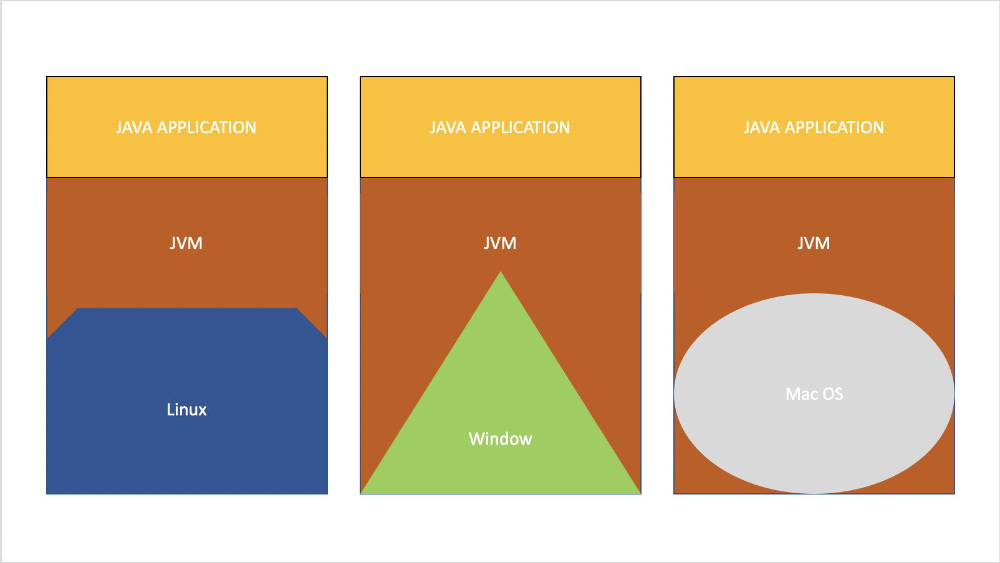
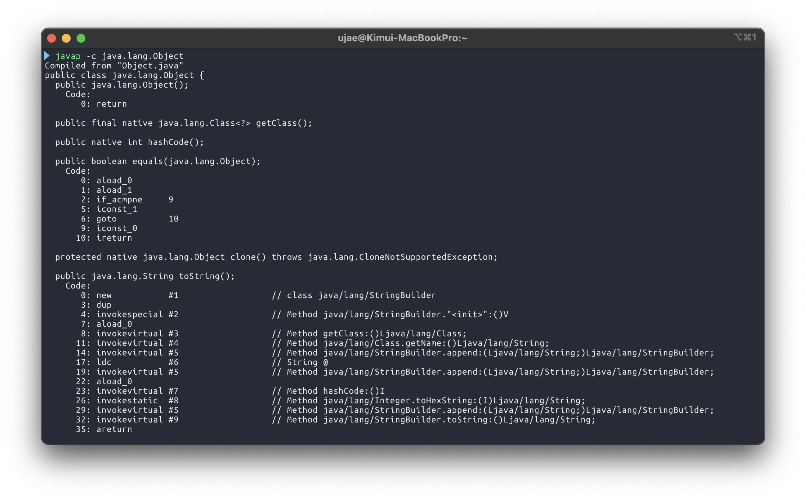
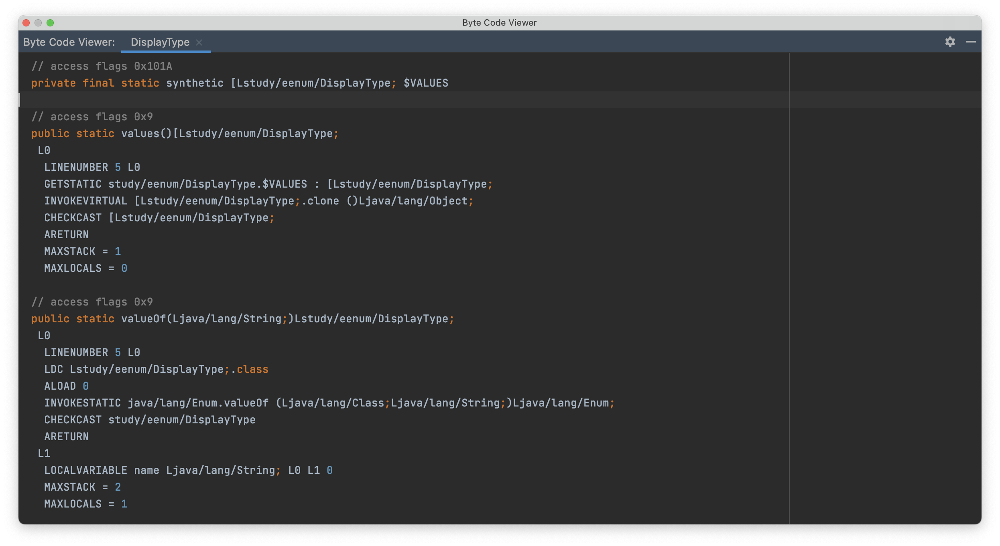
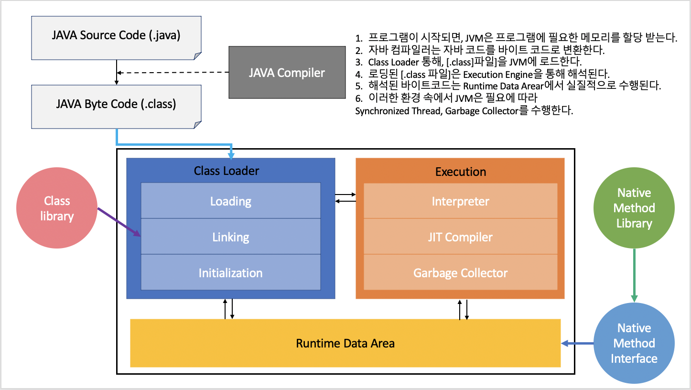
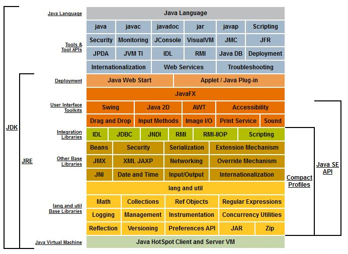

# 📚 들어가면서
      
[1. JVM](#-jvm)     
[2. JVM 동작 과정과 구성 요소](#-jvm-동작-과정과-구성-요소)     
[3. JDK와 JRE](#-jdk와-jre)         
[4. JVM과 JDK](#-jvm과-jdk)     
[5. 포함하지는 않았지만, 나중에 보면 좋을 내용들](#-포함하지는-않았지만-나중에-보면-좋을-내용들)    
[6. 참고](#-참고)    


# 📕 JVM 
> **Java Virtual Machine**의 약자로 OS에 맞는 Java 런타임 환경을 제공하는 가상머신이다.     
           
* `자바 애플리케이션`을 `클래스 로더`를 통해 읽어 들여 `자바 API`와 함께 **실행**한다.           
* JAVA와 OS 사이의 **중개자 역할**을 수행하여 JAVA가 OS에 종속되지 않고 재사용할 수 있도록 해준다.           
* **메모리 관리**, **Garbage collection**을 수행한다.       
* 스택 기반의 가상 머신으로 LIFO 원칙으로 동작한다.           
    
## 📖 Write once, run anywhere         


**플랫폼 종속성**   
1. 기계어가 CPU마다 다르다.  
2. 운영체제 API가 서로 다르다.
3. 운영체제마다 실행 파일 형식이 다르다.   
   
JVM이 등장하기 이전에는 **플랫폼 종속성으로 인해 OS마다 명령어를 해석하는 방법이 달랐다.**   
즉, 같은 소스 코드라도 **OS마다 명령어를 해석하는 방법이 달라 이에 따른 추가 작업을 진행해줘야 했다.**  
     
하지만, JVM이 등장하면서 소스 코드와 기계어의 중간 단계인 **`ByteCode`를 생성하고**            
**컴퓨터의 OS를 파악해 바이트코드를 알맞는 기계어로 변환하는 작업을 진행한다.**           
즉, `ByteCode`만 존재한다면 우리는 어떠한 OS 환경에서도 프로그램을 구동시킬 수 있다.      
      
이러한 JVM의 특징을 `WriteOnce,RunAnywhere(WORA)` 또는 `WriteOnce,RunEverywhere(WORE)`이라 부른다.    
     
추가로, `Kotlin`과 `Java` 소스 코드가 상호 운용이 가능한 이유도        
`Kotlin`으로 작성한 내용이 결국에 JVM에 의해 `ByteCode`로 변환되기 때문이다.          
즉, 이전 소스코드가 무엇이었든간에 JVM에서 `ByteCode`를 해석해서 명령을 내리기 때문이다.           
     
## 📖 ByteCode
> 특정 하드웨어가 아닌 VM에서 돌아가는 실행 프로그램을 위한 이진법으로 표현된 코드    
     
하나의 명령어의 크기가 1Byte(8bit)라서 ByteCode라고 부른다.        
하드웨어가 아닌 소프트웨어(VM)에 의해 처리되기 때문에, 기계어보다 추상적이며       
주로, 특정 하드웨어의 기계 코드를 만드는 컴파일러의 입력으로 사용되거나, 가상 컴퓨터에서 명령어를 바로 실행한다.    
    
결과적으로 특정 하드웨어에 대한 기계어를 사용하지 않아도 되므로 의존성을 줄인다.     
   
___

Java에서의 `ByteCode`는 JVM이 이해할 수 있는 언어로 변환된 `.class` 파일을 의미한다.       
 
이러한 `.class` 파일들은 `.java` 파일로 **역컴파일**할 수 있으며 이를 통해           
개발자들은 컴파일 타임에서 발생하는 여러 작업과 변경사항을 눈으로 확인할 수 있다.           
      
* CLI 기준 :  `javap -c FQCN_(.class 파일)`    
         
	    
   

* Mac + IntelliJ 기준 :              
  1. 소스코드에 커서를 위치시킨다.     
  2. `command + shift + a`를 누른다.  
  3. Actions 탭에서 `Show Bytecode`를 입력후 누른다.        


   

# 📗 JVM 동작 과정과 구성 요소



**JVM 동작 과정**   
1. JVM은 OS로부터 프로그램이 필요로 하는 메모리를 할당받는다.         
2. JVM은 메모리를 용도에 따라 여러 영역으로 나누어 관리한다.      
3. 자바 컴파일러가 자바 소스코드를 읽어들여 자바 바이트코드로 변환시킨다.     
4. Class Loader를 통해 class 파일들을 JVM으로 로딩한다.     
5. 로딩된 class 파일들은 Execution engine을 통해 해석된다.        
6. 해석된 바이트코드는 Runtime Data Areas에 배치되어 수행이 이루어진다.        
7. 실행 과정 속에서 JVM은 필요에 따라     
Thread Synchronization과 GC같은 관리작업을 수행한다.           

**JVM 구성 요소**
* Java source : 사용자가 정의한 자바 파일    
* Compiler : 자바를 클래스 파일로 변환   
* ByteCode : 클래스 파일들   
* ClassLoader : 클래스 파일들을 JVM으로 로드 및 링크하여 RuntimeDataArea에 배치    
* ExecutionEngine : 로딩된 클래스 파일들의 바이트코드를 해석하여 JVM에서 실행가능하도록 한다.   
* RuntimeDataArea : JVM이라는 프로세스가 프로그램을 수행하기 위하여 OS로부터 받은 메모리 공간   
* Interpreter : 자바 바이트코드를 명령어 단위로 읽고 해석하는 역할      
* JIT Compiler : 자바 바이트코드를 기계어로 변환시키는 역할     
* Garbage Collect : 더 이상 사용되지 않는 메모리를 해제해주는 역할   
       
     
## 📖 Class Loader(클래스 로더)         
* JVM내로 클래스`(.class)`를 로드하고, 링크를 통해 배치 작업을 수행하는 모듈.            
* Runtime 시에 동적으로 클래스를 로드한다. (지연 로딩)          
* 쉽게 말하면, 클래스를 처음으로 참조할 때 해당 클래스를 로드하고 링크한다.   
* jar파일 내 저장된 클래스들을 JVM내의 런타임 데이터 영역에 배치한다.    
* 사용 안 하는 클래스는 메모리에서 해제한다.              
       
## 📖 Execution Engine (실행 엔진)      
* 로드된 클래스 파일의 바이트코드를 실행하는 런타임 모듈         
* 바이트코드를 실제로 JVM내에서 실행할 수 있는 형태로 변경한다.          
   
### 📄 Interpreter          
바이트코드를 명령어 단위로 읽어서 실행한다.     
하지만, 한 번에 한 줄씩 수행하기 때문에 느리다는 단점이 있다.     
  
### 📄 JIT Compiler (Just - in - time)   
  
런타임시에 필요에 따라 바이트코드를 기계코드로 번역해 주는 컴파일러로 Dynamic Translation이라고도 부른다.               
               
프로그램의 실행 속도를 향상시키기 위해 개발되었으며        
프로그램 실행 전에 바이트코드가 JIT Compiler에 의해 기계 코드로 번역된다.   
   
번역으로 인해 프로그램 실행 전에 지연시간이 발생하게 되지만 대개 인터프리터보다 훨씬 좋은 성능을 보여준다.        
가상 컴퓨터의 이식성을 없애지만, 바이트코드 자체에 대한 이식성을 잃지는 않는다는 특징이 있다.        
   
**JIT 컴파일러 동작 기준과 원리**           
JIT Compiler가 컴파일하는 과정은 바이트코드를 인터프리팅하는 것보다 훨씬 오래걸린다.                 
그렇기 때문에 **한 번만 실행되는 코드라면 JIT Compiler 대신, 인터프리팅으로 처리를 한다**          
반대로, 반복, 중복으로 발생하는 바이트 코드가 있다면 JVM에서 얼마나 자주 수행되는지 체크하고,          
일정 기준을 넘는다면 `JIT Compiler`가 `ByteCode`를 기계어로 변환하고 **Caching 해놓는다.**            
이후, 같은 코드가 나온다면 **Caching을 사용하여 다시 번역할 필요 없이 해당 기계어를 가져와 사용한다.**           
참고로, `Caching`의 위치는 `JVM`안의 `CodeCache`에 들어간다.           
    
### 📄 Compiler 기술들    
#### 🔖 Hot Spot Detection     
JIT 컴파일러를 동작시키는 기술로,             
JVM이 ByteCode를 해석하다가 중복이 발생한다고 판단되면 Byte코드를 기계어로 컴파일하는 방식이다.        

**만약 중복된 코드가 아닌 모든 코드를 컴파일하면 안되는 걸까? 🤔**        
모든 코드를 컴파일하는 방식의 수행 시간 자체는 빠르지만                  
프로그램 크기가 커지고 기기별 이식성이 떨어진다는 문제점이 있다.           
그렇기에 JVM에서는 기본으로 `Interpreter` 방식을 사용하지만,       
여러 번의 중복이 발생하는 경우에만 `Hot Spot Detection` 방식을 사용한다.    
      
#### 🔖 Method inlining
`Method inlining`은 JIT 컴파일러에서 수행하는 최적화 방법으로            
자주 실행되는 메서드의 호출을 본문으로 대체하여             
**런타임시에 컴파일된 소스 코드를 최적화**하는 방법이다.               
      
```java
public void testAddPlusOne() {
  int v1 = addPlusOne(2, 5);
  int v2 = addPlusOne(7, 13);

}
public int addPlusOne(int a, int b) {
  return a + b + 1;
}
```
```java
public void testAddPlusOne() {
  int v1 = 2 + 5 + 1;
  int v2 = 7 + 13 + 1
}
```
JIT 컴파일러는 `Method inlining`를 통해 메서드 호출의 [오버헤드](https://ko.wikipedia.org/wiki/%EC%98%A4%EB%B2%84%ED%97%A4%EB%93%9C)를 피할 수 있다.       

### 📄 Garbage collector      
메모리가 부족할 때 사용되지 않는 메모리를 해제해주며 메모리가 부족하거나 JVM이 한가할 때 동작한다.       
즉, GC의 동작 시간은 일정하게 정해져 있지 않기 때문에 언제 객체를 정리하는지는 알 수 없다.         
    
참고로, GC를 수행하는 동안 GC Thread를 제외한 다른 모든 Thread는 일시 정지상태가 된다.         
특히, Full GC가 일어나는 수 초간 모든 Thread가 정지한다면 심각한 장애로 이어질 수 있다.           
            
## 📖 Runtime Data Area          
* 프로그램을 수행하기 위해 OS에서 할당받은 메모리 공간     

### 📄 PC Register       
Thread가 시작될 때 생성되는 공간으로 Thread마다 하나씩 존재한다.         
Thread가 어떤 부분을 어떤 명령어로 실행해야할지에 대해 기록을 한다.     
현재 수행 중인 JVM 명령의 주소를 갖는다.         

### 📄 JVM 스택영역         
프로그램 실행과정에서 임시로 할당되었다가     
메서드를 빠져나가면 바로 소멸되는 데이터를 저장하기 위한 영역이다.          
메서드 호출 시 각각의 스택 프레임(해당 메스드만을 위한 공간)이 생성되며     
이 안에 각종 형태의 변수나 임시 데이터, 스레드나 메서드 정보를 저장한다.       
메서드 수행이 끝나면 프레임별로 삭제를 진행한다.             

### 📄 Native method stack           
JAVA가 아닌 다른 언어로 작성된 코드를 위한 공간으로       
바이트코드가 아닌 기계어로 작성된 프로그램을 실행시키는 영역이다.       
커널이 스택을 잡아 독자적으로 프로그램을 실행시킨다.              

### 📄 Method Area(Class Area or Static Area)           
클래스를 처음 올릴 때 초기화되는 대상을 저장하기 위한 메모리 공간이다.        
Runtime Constant Pool이라는 상수 자료형을 저장 및 참조하여 중복을 막는 별도의 관리 영역도 함께 존재한다.      
Heap과 마찬가지로 GC의 관리 대상에 포함된다.             
   
**올라가는 클래스 정보의 종류 :**         
* **Field Information :**    
맴버변수의 이름, 데이터 타입, 접근 제어자에 대한 정보        
* **Method Information :**    
메서드의 이름, 리턴타입, 매개변수, 접근제어자에 대한 정보          
* **Type Information :**      
class인지 interface인지의 여부 저장    
Type의 속성, 전체 이름, super class의 전체 이름      
         
### 📄 Heap 영역               
클래스가 아닌 **객체를 저장하는 가상 메모리 공간이다.**                       
Method Area에 들어가는 데이터들과 다르게      
인스턴스는 **소멸 방법과 시점이 다르기에 `Heap`이라는 별도의 공간이 마련**되어있는 것이다.                
Heap에 저장된 인스턴스가 참조되지 않거나 더 이상 사용되지 않을 때 `GC`가 소멸시킨다.            
    
**힙의 3부분 :**      
* **Permanent Generation :**          
  생성된 객체들의 **주소값이 저장된 공간으로**          
  Class Loader에 의해 로드되는 Data(Class,Methiod)의 Meta Data가 저장되는 영역이다.     
  Reflection을 사용하여 동적으로 클래스가 로딩되는 경우에 사용되며        
  Spring의 경우 내부적으로 Reflection 기능을 사용하기에 이 영역에 대한 고려가 필요하다.        
  
* **New/Young 영역 :**     
  Eden : 객체들이 최초로 생성되는 공간을 말한다.      
  survivor: Eden에서 참조되는 객체들이 저장되는 공간을 말한다.         
* **Old 영역 :**          
  New area에서 일정 시간 참고되고 있는, 살아남은 객체들이 저장되는 공간이다.         
  Eden 영역에 객체가 가득차게 되면    
  * 첫 번째 GC가 발생       
  * Eden 영역에 있는 값들을 Survivor 1영역에 복사     
  * 이 영역을 제외한 나머지 영역의 객체를 삭제한다.      
        
# 📘 JDK와 JRE    

## 📖 JRE       
> Java Runtime Environment       
   
Java 프로그래밍 언어로 작성된 애플리케이션 및 응용 프로그램 실행을 위한   
`JVM`, `클래스 라이브러리`, `java 명령` 및 `기타 인프라` 구성 요소를 모은 패키지이다.    
       
단, 컴퓨터가 Java 프로그램을 실행시킬 수 있는 환경을 만드는 것이지    
Java 언어를 통해 애플리케이션이나 응용 프로그램을 직접 만들지는 못한다.     
개발 관련된 도구는 JDK에 존재하고 JRE에는 존재하지 않기 때문이다.        
          
* Java Virtual Machine의 실제 구현체       
* Java 프로그램을 실행하는 데 필요한 플러그인      
* JVM, 코어 라이브러리 및 Java로 작성된 응용 프로그램 실행을 위한 구성요소 포함     
       
## 📖 JDK  
> Java Development Kit    
   
자바의 모든 기능을 갖춘 [SDK](https://ko.wikipedia.org/wiki/%EC%86%8C%ED%94%84%ED%8A%B8%EC%9B%A8%EC%96%B4_%EA%B0%9C%EB%B0%9C_%ED%82%A4%ED%8A%B8)로     
컴퓨터에서 Java를 실행시킬 수 있는 환경을 구성해주는 JRE는 물론,      
애플리케이션 및 응용 프로그램 개발에 필요한 컴파일러 및 디버거와 같은 도구를 포함한다.   
    
* Java 기반 응용 프로그램을 개발하려면 JDK가 필요하다.      
* Java 기반 응용 프로그램을 개발하는 데 사용할 수 있는 소프트웨어 번들     
* JRE, API 클래스 세트, Java 컴파일러, 애플리케이션 제작에 필요한 파일 포함      

   
# 📌 JVM과 JDK   

* 특정 프레임워크가 JDK 14버전 이상으로 만들었다 가정한다.
* 하지만 컴퓨터가 사용하고 있는 JDK 버전은 8버전인데 호환이 가능하다? 🤔      


## 🔖 동일한 버전
```
/Library/Java/JavaVirtualMachines/jdk-14.0.1.jdk/Contents/Home/bin/javac Hello.java

/Library/Java/JavaVirtualMachines/jdk-14.0.1.jdk/Contents/Home/bin/java Hello
```
* JVM 14.0.1 버전으로 `Hello.java` 파일을 컴파일한다.     
* JVM 14.0.1 버전으로 실행하면 잘 동작한다.     

## 🔖 JVM 상위버전, JDK 하위버전  
```cmd
/Library/Java/JavaVirtualMachines/jdk-14.0.1.jdk/Contents/Home/bin/javac Hello.java

/Library/Java/JavaVirtualMachines/corretto-1.8.0_625.jdk/Contents/Home/bin/java Hello

UnsupportedClassVersionError: 클래스이름 has been compiled by a more recent version of the Java Runtime(class file version 58.0) this version of the Java Runtime only recognizes class file versions up to 52.0 
```
* JVM 14.0.1 버전으로 `Hello.java` 파일을 컴파일 했다.     
* JVM 1.8.0_625 버전으로 실행을 시키니 에러가 발생했다.     

상위 버전으로 컴파일된 바이트 코드는 하위 버전의 JVM에서 실행할 수 없다.   
   
하지만, 정확히 말하면 **특정 옵션을 주지 않으면 실행할 수 없다.**    
즉, **특정 옵션을 주면 상위 버전으로 컴파일 된 바이트 코드를 실행시킬 수 있다.**    
      
```linux
/Library/Java/JavaVirtualMachines/jdk-14.0.1.jdk/Contents/Home/bin/javac -source 1.8 -target 1.8 Hello.java
/Library/Java/JavaVirtualMachines/corretto-1.8.0_625.jdk/Contents/Home/bin/java Hello
> HELLO WORLD
```   
   
**그렇다면 상위 버전의 최신 기능은 사용하지 못하는 걸까? 🤔**      
* 아니다. 최신 기능도 사용할 수 있다.         
* 옵션 컴파일로 8 버전에서 인식하는 바이트코드를 만드는 것일 뿐이다.       
* 즉, 최신 기능을 포함한 바이트코드로 변환되었다 생각하면 된다.            
* 단, 모든 하위 버전이 가능한 것은 아니고 각 상위 버전마다 호환이 가능한 최소 하위 버전이 지정되어 있다는 점만 알아두자.           
          
# ✔ 포함하지는 않았지만, 나중에 보면 좋을 내용들            
[JIT 컴파일러 튜닝](https://velog.io/@youngerjesus/%EC%9E%90%EB%B0%94-JIT-%EC%BB%B4%ED%8C%8C%EC%9D%BC%EB%9F%AC)        
[we-hate-jvm-GarbageCollection](https://github.com/Road-of-CODEr/we-hate-jvm/tree/master/GarbageCollection)    
    
# 😉 참고
[백기선님, 스터디 할래](https://github.com/whiteship/live-study)     
[자바 가상머신, JVM이란 무엇인가?](https://asfirstalways.tistory.com/158)         
[JVM_스터디할래_jiny](https://jeongjin984.github.io/posts/JVM/)   
[javac option-oracle doc](https://docs.oracle.com/javase/7/docs/technotes/tools/windows/javac.html)       
