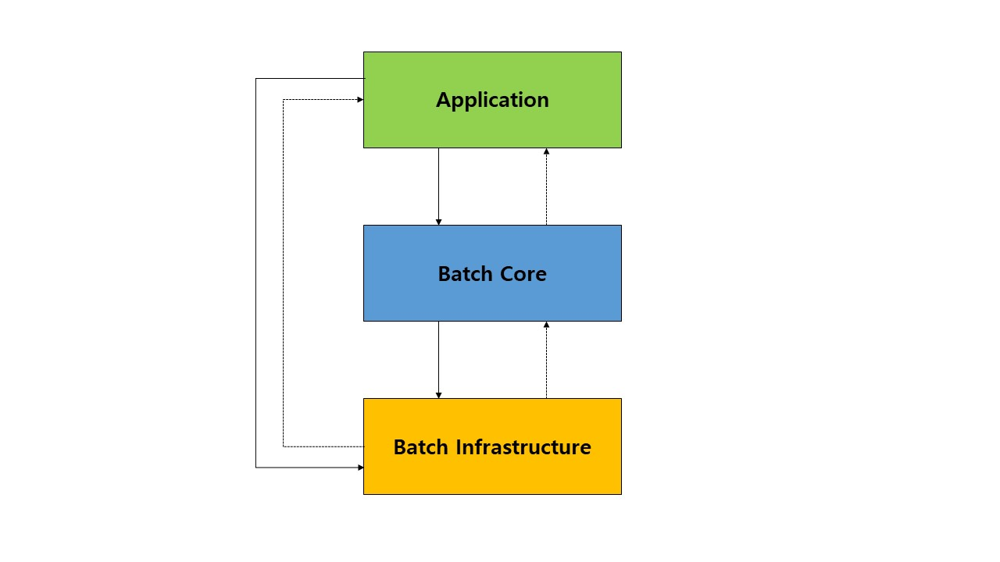
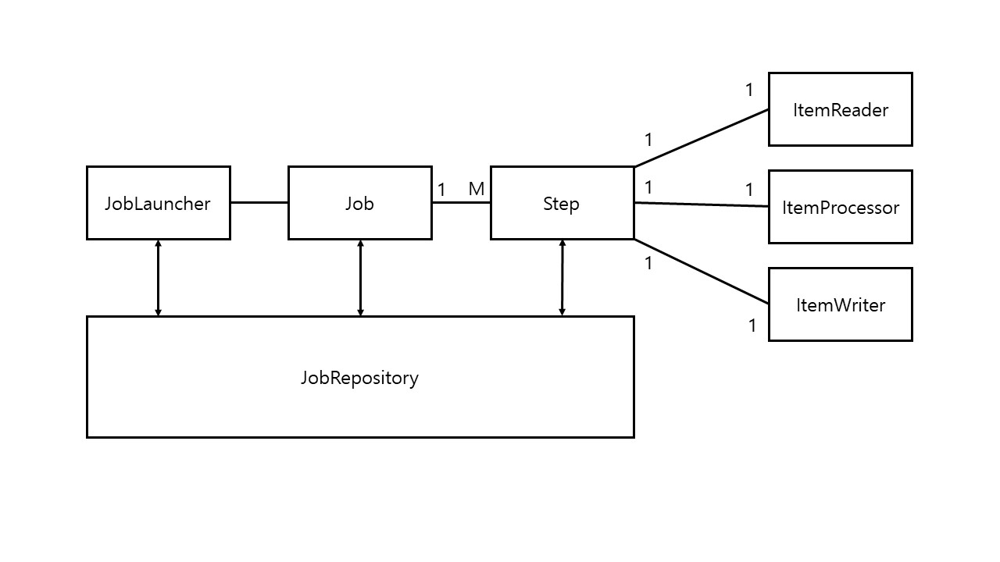
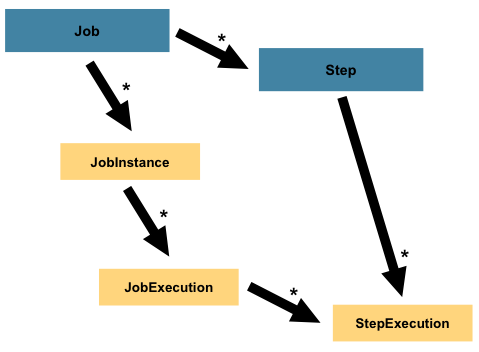

SpringBatch 개요 및 도메인 용어
=======================
# 📕 스프링 배치란?
> 스프링 배치란 무엇일까?   

스프링 배치란, [배치 처리 기능]()을 구현하는데 사용하는 프레임워크다.      
쉽게 설명하면 `일련의 작업`을 정해진 로직으로 수행하는 것이라고 할 수 있다.   
      
`스프링 배치`는 스프링의 특징(POJO, 생산성, 사용 편의성)을 기반으로 만들어졌으며  
스프링 배치의 설정 요소들을 간편화시켜 스프링 배치를 빠르게 설정하는 `스프링 부트 배치`도 존재한다.
       
참고로, `스프링 배치`는 스케줄링 프로그램은 아니다.       
이는 [스프링 배치 공식 문서](https://docs.spring.io/spring-batch/docs/4.2.x/reference/html/index-single.html)에서도 언급되어 있는데     
`Quartz`, `Tivoli`, `Control-M`와 같은 스케줄러와 함께 동작하도록 설계되어 있다.        
     
**용어**
```
배치 : 프로그램의 흐름에 따라 순차적으로 자료를 처리한다 
배치 처리 : 일괄처리  
```
  
# 📗 배경지식  

스프링 배치는 스프링 본부인 `Pivotal Software`와 컨설팅 회사인 `Accenture`가 공동으로 개발되었다.      
`Accenture`는 그간, 수년간의 노력으로 다져진 배치 처리 경험 및 노하우를 가지고 있었고    
`Pivotal`은 스프링의 `DI`, `AOP`, `서비스 추상화`와 같은 좋은 아키텍처를 구현할 능력을 가지고 있었다.    
즉, `Accenture`의 배치 노하우 & 기술력과 `Spring 프레임워크`가 합쳐져 만들어진 것이 `Spring Batch` 이다.     
   
## 📖 배치 처리에 스프링 부트 배치를 사용해야 하는 이유     

**스프링 부트 배치 장점**   
* 대용량 데이터 처리에 최적화되어 고성능을 발휘한다.       
* 효과적인 `로깅`, `통계처리`, `트랜잭션 관리`등 재사용 가능한 필수 기능을 지원한다.     
* 수동으로 처리하지 않도록 자동화되어 있다.      
* 예외사항과 비정상 동작에 대한 방어 기능이 있다.     
* 스프링 부트 배치의 반복되는 작업 프로세스를 이해하면 비즈니스 로직에 집중할 수 있다.      
      
백엔드에서 일어나는 배치 처리에 대한 대부분의 고민은 이미 스프링 부트 배치에서 기능으로 제공한다.   
따라서 우리는 스프링 부트 배치의 기능을 잘 이해하고 효과적으로 사용하며 비즈니스 로직을 더욱 견고하게 작성하면 된다.    

## 📖 스프링 배치 아키텍처
   


스프링 배치는 확장성과 다양한 사용자 유형을 고려해 설계했다.   
이 계층 구조는 3가지 주요 컴포넌트가 있는데  
각각 `Application`, `Batch Core`, `Batch Infrastructure` 가 있다.   

* **Application :** 스프링 배치를 사용하는 개발자가 만드는 모든 Job과 커스텀 코드를 포함한다.  
* **Batch Core :** Job을 실행하고 제어하는데 필요한 핵심 런타임 클래스를 포함한다.   
    * JobLauncher, Job, Step 구현체도 포함된다.   
* **Batch Infrastructure :** 공통 Reader 와 Writer, 서비스(RetryTemplate 같은)를 포함한다.
    * 애플리케이션 개발자도 사용 가능하고,  
    * (ItemReader, ItemWrtier 등의 reader와 writer) 코어 프레임워크 자체에서도 활용된다.   
   
참고로, 위 그림을 보면 알 수 있듯이  
`Application` 과 `Bacth Core`는 `Batch Infrastructure` 위에서 빌드 된다.   
   
## 📖 스프링 부트 배치 2.0   
`스프링 부트 배치 2.x`은 최신 버전인 `스프링 배치 4.x`를 기반으로 한다.       
`스프링 배치 4.0` 은 다음 3가지 특성이 있다.      
         
1. 자바 8 이상에서 동작한다.          
2. 스프링 프레임워크 5로 버전 업하면서 새롭게 재 배열된 의존성 트리를 지원한다.         
3. `ItemReaders`, `ItemProcessors`, `ItemWriters`에 대한 `빌더`를 제공한다.       
    
## 📖 스프링 부트 배치 주의사항    
사실 스프링 부트 배치 뿐만 아니라 배치를 사용함에 있어 원칙 및 지침에 대해서 기술해보고자 한다.     
따라서 스프링 부트 배치와 스프링 배치 모두에서 다음과 같은 주의사항을 염두에 두기 바란다.     
   
1. 단일 배치 어플리케이션은 가능한 **단순해야하고 복잡한 로직을 피하도록 한다.**           
2. **데이터 처리와 저장은 물리적으로 가까운 곳에서 수행**시키자(데이터가 처리되는 곳에 데이터를 저장)   
3. 배치 처리 시 **시스템 I/O 사용을 최소화**해야 한다.(내부 메모리에서 가능한 많은 연산을 실행하라)                
    * 잦은 I/O 로 인해 데이터베이스 커넥션과 네트워크 비용이 커지면 성능에 영향을 줄 수 있기 때문이다.        
      따라서 가능하면 한번에 데이터를 조회하여 메모리에 저장해두고 처리를 한 다음,   
      그 결과를 한번에 데이터베이스에 저장하는 것이 좋다.                
4. 일반적으로 같은 서비스에 사용되는 `웹`,`API`,`배치`,`기타 프로젝트`들은 서로 영향을 주기 마련이다.          
   따라서 **배치 처리가 진행되는 동안 다른 프로젝트 요소에 영향을 주는 경우가 없는지 주의를 기울여야 한다.**          
5. 스프링 부트 배치는 스케줄러를 제공하지 않는다.             
   쿼츠와 같은 스케줄링 프레임워크를 사용한다면         
   클러스터링뿐만 아니라 다양한 스케줄링 기능, 실행 이력 관리등 여러 이점을 얻을 수 있다.         
 
# 📘 스프링 배치와 도메인 용어   
배치의 일반적인 시나리오는 다음과 같은 3단계로 이루어집니다.   

1. **읽기 :** 데이터 저장소(일반적으로 데이터베이스)에서 **특정 데이터 레코드를 읽는다.**   
2. **처리 :** 원하는 방식으로 **데이터를 가공/처리한다.**   
3. **쓰기 :** 수정된 데이터를 **다시 저장소(데이터베이스)에 저장한다.**         
              
즉, 배치 처리는 `읽기` -> `처리` -> `쓰기` 흐름을 갖는다.        
그렇다면 스프링에서는 이러한 배치 처리의 흐름을 어떻게 구현했는지 알아보자           
     
다음 그림은 배치 처리와 관련된 객체의 관계를 보여준다.        
     
      
   
* Job과 Step은 `1:M 관계`를 가진다.   
* Step과 `ItemReader`, `ItemPeocessor`, `ItemWriter`는 `1:1 관계`를 가진다.     
           
즉, `하나의 큰 Job`에 `여러 Step`을 두고, 각 단계를 배치의 기본 흐름대로 구현한다.    
         
## 📖 Job    


`Job`은 **배치 처리 과정을 하나의 단위로 만들어 표현한 객체다.**        
또한, 전체 배치 처리에 있어 **항상 최상단 계층에 있다.**      
          
위에서 `하나의 Job` 안에는 `여러 Step`이 있다고 설명했던 바와 같이      
스프링 배치에서 `Job 인스턴스`는 `여러 Step 인스턴스`를 포함하는 컨테이너다.       
            
`Job 인스터스`를 만드는 빌더는 여러 개 있다.     
여러 빌더를 통합 처리하는 공장인 `JobBuilderFactory`로 원하는 `Job`을 손쉽게 만들 수 있다.        
`JobBuilderFactory`의 `get()` 메서드로 `JobBuilder`를 생성하고 이를 이용하면 된다.        
     
## 📖 JobBuilderFactory
```java
public class JobBuilderFactory {

	private JobRepository jobRepository;

	public JobBuilderFactory(JobRepository jobRepository) {
		this.jobRepository = jobRepository;
	}

	public JobBuilder get(String name) {
		JobBuilder builder = new JobBuilder(name).repository(jobRepository);
		return builder;
	}
}
```   
`JobBuilderFactory`는 `JobBuilder`를 생성할 수 있는 `get()` 메서드를 포함하고 있다.         
`get()` 메서드 내부를 들여다보면 `JobBuilderFactory`가 새로운 `JobBuilder`를 생성해서 반환하는 것을 확인할 수 있다.     
`JobBuilderFactory` 에 **`get()` 메서드를 호출할 때마다 새로운 빌더가 생성되는 것이다.**      

게다가 새로운 `JobBuilder`를 생성할 때마다 생성자로 주입 받은 `JobRepository`를 사용할 리포지토리로 설정한다.               
즉, 동일한 `JobBuilderFactory 인스턴스`에서 생성되는 모든 `JobBuilder`들은 **동일한 리포지토리를 사용한다.**              
  

## 📖 JobBuilder
`JobBuilderFactory`는 앞서 설명한 바와 같이 `JobBuilder`를 생성하는 역할만 수행한다.   
그리고 이렇게 생성된 `JobBuilder`를 이용해서 `Job`을 생성해야 한다.   
    
**JobBuilder의 일부 코드**
```java
// Step을 추가해서 가장 기본이 되는 SimpleJobBuilder를 생성한다.   
public SimpleJobBuilder start(Step step){
  return new SimpleJobBuilder(this).start(step);
}

// Flow를 실행할 JobFlowBuilder를 생성한다.   
public JobFlowBuilder start(Flow flow){
  return new JobFlowBuilder(this).start(flow);
}
   
// Step을 실행할 JobFlowBuilder를 생성한다.     
public JobFlowBuilder flow(Step step){
  return new JobFlowBuilder(this).start(step);
}
```
     
`JobBuilder`의 메서드를 살펴보면, 모두 반환 타입이 `빌더`다.         
`JobBuilder`는 직접적으로 `Job`을 생성하는 것이 아니라 **별도의 구체적인 빌더를 생성**하여 반환한다.              
             
**그렇다면 왜 이렇게 별도의 빌더를 생성하게 끔 구현되어 있을까? 🤔**       
경우에 따라 Job 생성 방법이 모두 다르기 때문에    
별도의 구체적인 빌더를 구현하고 이를 통해 Job 생성이 이루어지게 하려는 의도록 파악된다.   
        
**중간에 빌더를 한번 더 반환받아 사용**해야 하므로 불편할 수 있다는 생각이 들지도 모르겠지만          
`메서드 체인` 방식을 활용하면 **구체적인 빌더의 존재를 생각하지 않아도 될 만큼 손쉽게 처리할 수 있다.**        
         
메서드를 좀 더 자세히 살펴보면 `Job`을 생성하기 위한 `Step` 또는 `Flow`를 파라미터로 받아 구체적인 빌더를 생성한다.                  
`Job`은 `Step` 또는 `Flow 인스턴스`의 컨테이너 역할을 하기 때문에 생성하기 전에 인스턴스를 전달받는다.           
      
___   
         
그럼 `JobBuilder`로 가장 간단하게 만들 수 있는 빌더인 **SimpleJobBuilder를 이용해 Job을 생성해보자**   

**구조**   
```java
    @Autowired
    private JobBuilderFactory jobBuilderFactory;
    
    @Bean
    public Job simpleJob(){
        return jobBuilderFactory.get("생성할 JOB 이름")
                .start(Step객체);
                .build();
    }
```

**예시**
```java
    @Autowired
    private JobBuilderFactory jobBuilderFactory;
    
    @Bean
    public Job simpleJob(){
        return jobBuilderFactory.get("simpleJob")
                .start(simpleStep());
                .build();
    }
```
> 우선 여기에 나온 코드들은 위에서 한 번씩 기술한 메서드들이다.  
    
`get()`메서드는 넘겨온 파라미터를 생성자로 받는 **JobBuilder 객체 인스턴스를 반환된다.**     
설명이 어렵기에 코드로 표현하면 `return new JobBuilder(name).repository(jobRepository);`로 되어있다.   
정리하자면, **"simpleJob"이름을 가진 `Job`** 을 `생성할 수 있는` **JobBuilder 객체 인스턴스가 반환된다.**     
   
`start()`메서드는 파라미터로 `Step 인스턴스`를 받는다.   
또한, 체이닝을 진행하기에 반환형으로 `SimpleJobBuilder`를 반환한다.      
`불변 객체`를 위해서 `new`를 통해 새로운 객체를 반환하는 것 같다.    
예제의 `simpleStep()` 메서드는 아주 간단한 `Step` 인스턴스를 생성 및 반환하는 메서드라 가정한 것이다.  

마지막으로 `SimpleJobBuilder`의 `build()` 메서드를 호출하여 빌드하면    
비로소 `"simpleJob"` 이라는 이름을 가진 `Job`이 생성되어 반환된다.   
   
## 📖 JobInstance   
`JobInstance`는 배치에서 `Job이 실행될 때` **하나의 Job 실행 단위**이다.   
만약 하루에 한 번씩 배치의 `Job`이 실행된다면    
어제와 오늘 실행한 각각의 `Job`을 `JobInstance`라고 부를 수 있다.         

그렇다면 각각의 `JobInstance`는 하나의 `JobExecution`을 갖고 있을까?
이에 대한 대답은 **아니다.** 라고 말할 수 있을 것 같다.   
   
**JobExecution? 🤔**
```
JobExecution는 JobInstance에 대한 한번의 실행을 나타내는 객체다.  
자세한 설명은 바로 다음 Context에서 설명하겠다. 😉          
```

**`Job` 실행이 실패하면 `JobInstance`가 끝난 것으로 간주하지 않는다.**        
즉, 오늘 Job을 실행했는데 실패했다면 다음날 **동일한 `JobInstance`를 가지고 또 실행한다.**   
       
결과적으로 `JobInstance`는 아래와 같은 `JobExecution` 가지게 된다.      
    
* 어제의 실패한 `JobExecution`
* 오늘의 성공한 `JobExecution` 

그렇기에, `JobInstance`는 `JobExecution`을 여러 개 가질 수 있다.   
    
## 📖 JobExecution       
`JobExecution` 은 `JobInstance`에 대한 한 번의 실행을 나타내는 객체다.              
`JobExecution` 인터페이스를 보면 **`Job` 실행에 대한 정보**를 담고 있는 도메인 객체라는 것을 알 수 있다.           
`JobExecution`은 `JobInstance`, `배치 실행 상태`, `시작 시간`, `끝난 시간`, `실패했을 때의 메시지`등의 정보를 담고 있다.       

**JobExecution 일부**
```java
public class JobExecution extends Entity {

	private final JobParameters jobParameters;
	private JobInstance jobInstance;
	private volatile Collection<StepExecution> stepExecutions = Collections.synchronizedSet(new LinkedHashSet<>());
	private volatile BatchStatus status = BatchStatus.STARTING;
	private volatile Date startTime = null;
	private volatile Date createTime = new Date(System.currentTimeMillis());
	private volatile Date endTime = null;
	private volatile Date lastUpdated = null;
	private volatile ExitStatus exitStatus = ExitStatus.UNKNOWN;
	private volatile ExecutionContext executionContext = new ExecutionContext();
	private transient volatile List<Throwable> failureExceptions = new CopyOnWriteArrayList<>();
	private final String jobConfigurationName;

...
```
   
* **jobParameters :** Job 실행에 필요한 매개변수 데이터            
* jobInstance : Job 실행의 단위가 되는 객체              
* stepExecutions : StepExecution을 여러개 가질 수 있는 Collection 타입        
* status : Job 의 실행 상태를 나타내는 필드         
    * 상태값은 `COMPLETED`, `STARTING`, `STARTED`, `STOPPING`, `STOPPED`, `FAILED`, `ABANONED`, `UNKNOWN`등이 있다.         
    * 기본 값은 `SRARTING` 이다.          
* startTime : Job이 실행된 시간     
    * null 이면 아직 시작하지 않았다는 것을 의미한다.         
* createTime : JobExecution 이 생성된 시간            
* endTime : JobExecution이 끝난 시간 (Job이 아닌, JobExecution이다.)        
* lastUpdated : 마지막으로 수정된 시간         
* exitStatus : Job 실행 결과에 대한 상태        
    * 상태값은 `UNKNOWN`, `EXECUTING`, `COMPLETED`, `NOOP`, `FAILED`, `STOPPED` 등이 있다.
    * 기본값은 `UNKNOWN` 이다.          
* executionContext : Job 실행 사이에 유지해야 하는 사용자 데이터가 들어있다.      
* failureExceptions : job 실행 중 발생한 예외를 List 타입으로 저장한다.       
* jobConfigurationName : Job 설정 이름        
       
## 📖 JobParameters   


`JobParameters`는 **`Job`이 실행될 때 필요한 파라미터들을 `Map` 타입으로 지정하는 객체다.**          
      
**`JobParameters`는 `JobInstance`를 구분하는 기준이 되기도 한다.**        
예를 들어, `Job` 하나를 생성할 때 `시작 시간` 등의 정보를 파라미터로 해서 하나의 `JobInstance`를 생성한다면?   
각각의 `JobInstance`들은 서로 다른 `시작 시간`을 가지게 되므로 구분이 될 수 있다.      
이와 같은 방법을 사용하면, `JobInstance`와 `JobParameters`는 1:1 관계가 될 수 있다.            
참고로, 파라미터의 타입으로는 `String`, `Long`, `Date`, `Double`을 사용할 수 있다.         

          
## 📖 JobRepository           
`JobRepository` 는 배치 처리 정보를 담고 있는 매커니즘이다.               
어떤 Job이 실행되었으며 몇 번 실행되었고 언제 끝났는지 등 **배치 처리에 대한 메타데이터를 저장한다.**        
예를 들어 Job 하나가 실행되면, `JobRepository`에서는 **배치 실행에 관련된 정보를 담고 있는 도메인 `JobExecution`을 생성한다.**            
또한, `Step`의 실행 정보를 담고 있는 **`StepExecution`도 저장소에 저장하며 전체 메타데이터를 저장/관리하는 역할을 수행한다.**              
   
즉, 앞서 정리했던,   
`JobExecution`을 생성하고 `StepExecution`을 저장하는 역할을 한다.     
   
## 📖 JobLauncher   
`JobLauncher` 는 `Job`, `JobParameters`와 함께 **배치를 실행하는 인터페이스다.**     
인터페이스의 메소드도 `run()` 하나이다.     
     
**JobLauncher**
```java
package org.springframework.batch.core.launch;

import org.springframework.batch.core.Job;
import org.springframework.batch.core.JobExecution;
import org.springframework.batch.core.JobParameters;
import org.springframework.batch.core.JobParametersInvalidException;
import org.springframework.batch.core.repository.JobExecutionAlreadyRunningException;
import org.springframework.batch.core.repository.JobInstanceAlreadyCompleteException;
import org.springframework.batch.core.repository.JobRestartException;

public interface JobLauncher {
	public JobExecution run(Job job, JobParameters jobParameters) throws JobExecutionAlreadyRunningException,
			JobRestartException, JobInstanceAlreadyCompleteException, JobParametersInvalidException;

}
```
`run()` 메서드는 매개변수로 `Job`과 `JobParameters`를 받아 `JobExecution`을 반환한다.   
만약 매개변수가 이전과 동일하면서, 이전에 `JobExecution`이 중단된 적이 있다면 동일한 `JobExecution`을 반환한다.   
  
## 📖 Step      



`Step`은 **실질적인 `배치 처리를 정의하고 제어하는데 필요한 모든 정보`가 들어 있는 도메인 객체다.**    
그렇기에 **`Job`을 처리하는 실질적인 단위**로 쓰인다.      
모든 `Job`에는 최소 1개 이상의 `Step`이 있어야 한다.      

## 📖 StepExecution   
`Job`에는 `JobExecution`이라는 `Job 실행 정보`가 있듯이       
`Step` 에도 `StepExecution` 이라는 `Step 실행 정보`를 담는 객체가 있다.   
       
각각의 `Step`이 실행될 때 마다 `StepExecution`이 생성된다.       
   
**StepExecution**
```java
public class StepExecution extends Entity {

	private final JobExecution jobExecution;
	private final String stepName;
	private volatile BatchStatus status = BatchStatus.STARTING;
	private volatile int readCount = 0;
	private volatile int writeCount = 0;
	private volatile int commitCount = 0;
	private volatile int rollbackCount = 0;
	private volatile int readSkipCount = 0;
	private volatile int processSkipCount = 0;
	private volatile int writeSkipCount = 0;
	private volatile Date startTime = new Date(System.currentTimeMillis());
	private volatile Date endTime = null;
	private volatile Date lastUpdated = null;
	private volatile ExecutionContext executionContext = new ExecutionContext();
	private volatile ExitStatus exitStatus = ExitStatus.EXECUTING;
	private volatile boolean terminateOnly;
	private volatile int filterCount;
	private transient volatile List<Throwable> failureExceptions = new CopyOnWriteArrayList<Throwable>();
	
...
```
    
* jobExecution : 현재의 JobExecution 정보를 담고 있는 필드
* stepName : Step의 이름을 가지고 있는 필드       
* status : Step의 실행 상태를 나타내는 필드     
    * 상태값은 `COMPLETED`, `STARTING`, `STARTED`, `STOPPING`, `STOPPED`, `FAILED`, `ABANDONED`, `UNKNOWN` 등이 있다.         
    * 기본값은 `STARTING` 이다.        
* readCount : 성공적으로 읽은 레코드 수     
* writeCount : 성공적으로 쓴 레코드 수    
* commitCount : Step 의 실행에 대해 커밋된 트랜잭션 수 
* rollbackCount : Step의 실행에 대해 롤백된 트랜잭션 수      
* readSkipCount : 읽기에 실패해 건너뛴 레코드 수       
* processSkipCount : 프로세스가 실패해 건너뛴 레코드 수     
* writeSkipCount : 쓰기에 실패해 건너뛴 레코드 수       
* startTime : Step이 실행된 시간 
    * null이면 시작하지 않았다는 것을 나타낸다.    
* endTime : Step의 실행 성공 여부와 관련 없이 Step이 끝난 시간   
* lastUpdated : 마지막으로 수정된 시간   
* executionContext : Step 실행 사이에 유지해야 하는 사용자 데이터가 들어있다.      
* exitStatus : Step 실행 결과에 대한 상태  
    * 상탯값은 `UNKNOWN`, `EXECUTING`, `COMPLETED`, `NOOP`, `FAILED`, `STOPPED` 등이 있다.   
    * 기본값은 `UNKNOWN` 이다.       
* terminateOnly : `Job` 실행 중지 여부       
* filterCount : 실행에서 필터링된 레코드 수    
* failureExceptions : Step 실행 중 발생한 예외를 List 타입으로 저장한다.     

## 📖 ItemReader   
`ItemReader` 는 `Step`의 대상이 되는 배치 데이터를 읽어오는 인터페이스다.   
`FILE`, `XML`, `DB` 등 여러 타입의 데이터를 읽어올 수 있다.      

**ItemReader**
```java
package org.springframework.batch.item;

public interface ItemReader<T> {
	T read() throws Exception, UnexpectedInputException, ParseException, NonTransientResourceException;
}
```
`ItemReader`에서 `read()` 메서드의 반환 타입을 제네릭으로 구현했기 때문에 **직접 타입을 지정할 수 있다.**         
      
## 📖 ItemProcessor   
`ItemProcessor`는 **`ItemReader`로 읽어온 배치 데이터를 변환하는 역할을 수행한다.**                

**그렇다면 왜?, `ItemWriter`에 변환하는 로직을 넣을 수도 있는데 `ItemProcessor`를 따로 제공했을까? 🤔**         
         
그 이유는 2가지다.         
1. **비즈니스 로직을 분리하기 위해서**      
   `ItemWriter` 는 저장만 수행하고,     
   `ItemProcessor` 는 로직 처리만 수행해 역할을 명확하게 분리한다.            
2. `읽어온 배치 데이터`와 `쓰여질 데이터의 타입`이 다를 경우에 대응하기 위해서다.             
   명확한 인풋과 아웃픗을 `ItemProcessor`로 구현해 놓는다면 더 직관적인 코드가 될 것입니다.      
    
**ItemProcessor**
```java
package org.springframework.batch.item;

public interface ItemProcessor<I, O> {
	O process(I item) throws Exception;
}
```
제네릭을 사용해 `인풋`, `아웃풋 타입`을 정의하고 비즈니스 로직을 구현한다.         
   
## 📖 ItemWriter   
`ItemWriter`는 배치 데이터를 저장하는 역할을 한다.       
일반적으로 배치 데이터들은 `DB`나 `파일`에 저장한다.           
      
**ItemWriter**
```java
package org.springframework.batch.item;

import java.util.List;

public interface ItemWriter<T> {
	void write(List<? extends T> items) throws Exception;
}
```   
`ItemWriter`도 `ItemReader`와 비슷한 방식으로 구현하면 된다.            

* 제네릭으로 원하는 타입을 받는다.       
* `write()`는 `List` 자료구조를 사용해 지정한 타입의 리스트를 매개변수로 받는다.         
* 리스트의 데이터 수는 설정한 청크 단위(아이템이 트랜잭션에서 커밋되는 수)로 불러온다.         
* `write()` 메서드의 반환값은 따로 없고 **매개변수로 받은 데이터를 저장하는 로직을 구현하면 된다.**         

# 참고 🔍
[처음 배우는 스프링 부트 2.0](http://www.yes24.com/Product/Goods/64584833)   
[Spring.io.batch_reference](https://docs.spring.io/spring-batch/docs/4.3.x/reference/html/domain.html#item-writer)
