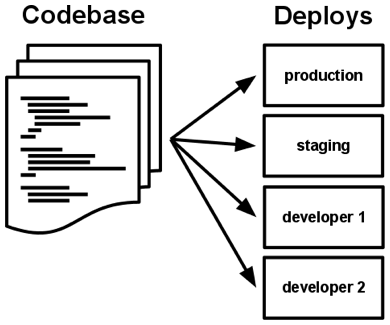

# Cloud & MSA

## Cloud Native
핵심은 애플리케이션을 어떻게 만들고 배포하는지에 있으며 위치는 중요하지 않다. 
클라우드 서비스를 활용한다는 건 컨테이너와 같이 민첩하고 확장 가능한 구성 요소를 사용해서 재사용 가능한 개별 기능을 제공하는 걸 의미한다. 
이런 기능은 멀티 클라우드와 같은 여러 기술 간의 경계가 매끄럽게 통합되므로 제공 팀이 반복 가능한 자동화와 오케스트레이션을 사용해 빠르게 작업 과정을 반복할 수 있다.
* 신축성 (Resiliency)
* 민첩성 (Agility)
* 확장 가능성 (Scalable)
* 자동화 (Automation)
* 무상태 (Stateless)

---

## MSA - 12 Factors

### Codebase
버전 관리되는 하나의 코드베이스와 다양한 배포. 개발/테스트/운영(인스턴스)는 동일한 코드 기반이어야 한다.

> 이미지 출처: https://12factor.net/

### Dependencies
명시적으로 선언되고 엄격하게 분리된 의존성. 필요한 의존성을 애플리케이션과 함께 담는다.

### Config
환경설정은 코드와 엄격하게 분리(yml, properties). 코드베이스는 하나, 환경에 따라 config만 바꿔야 한다.

### Backing Services
백엔드 서비스를 연결된 리소스로 취급. URL을 통해 바인딩되어야 한다.

> 이미지 출처: https://12factor.net/

### Build, Release, Run
분리된 빌드와 실행 단계를 가져야 한다.

> 이미지 출처: https://12factor.net/

### Stateless Process
애플리케이션을 하나 혹은 여러개의 무상태 프로세스로 실행. 상태는 외부 저장소에 보관한다.

### Port Binding
포트 바인딩을 사용해 서비스 노출. 별도의 웹서버를 두지 않고 self-contained로 서비스 제공

### Concurrency
프로세스 모델을 사용한 확장(scale out). 프로세스가 확장될 수 있도록 설계해야 한다.

> 이미지 출처: https://12factor.net/

### Disposability
빠른 시작과 graceful shutdown을 통한 안정성 극대화

### Dev/Prod parity
development, staging, production 환경을 최대한 동일하게 유지한다.

### Logs
로그를 이벤트 스트림으로 취급. 로컬 서버에 저장하지 말고 중앙 저장소로 수집

### Admin Processes
admin/maintenance 작업을 일회성 프로세스로 실행

---

## Spring Cloud Architecture

> 이미지 출처: https://spring.io/cloud