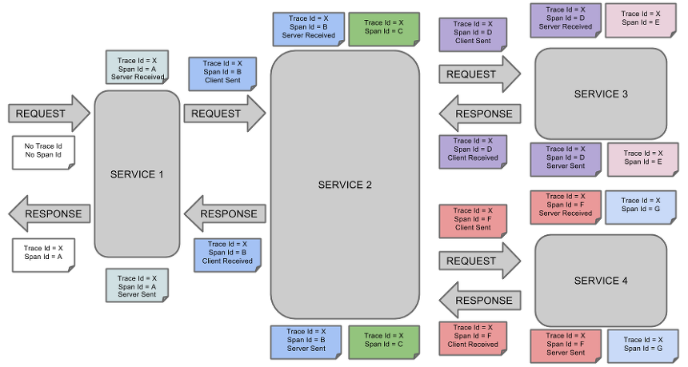
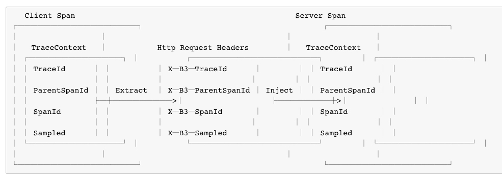

# Spring Cloud Sleuth
오늘은 Spring Cloud Sleuth를 알아볼겁니다. 알아볼거에요.

## Sleuth란?
MSA 구조에서 클라이언트의 request는 내부적으로 여러 MS를 거치게 됩니다.<br>
이 구조에서 전체 트랜잭션에 대한 로그를 어떻게 추적할 수 있을까요?<br>
이를 해결할 수 있도록 추적 관련 ID(traceId, spanId)를 자동으로 생성해주는 것이 Spring Cloud Sleuth입니다..!!
> Sleuth는 Async와 Scheduled도 지원한다.

## Sleuth의 ID 전파 예시

> 이미지 출처: https://cloud.spring.io/spring-cloud-sleuth/2.0.x/single/spring-cloud-sleuth.html

ID 종류 | 설명
-------|-------
traceId | - 최초 호출 시 실행되는 서비스에서 생성
spanId | - thread마다 새로운 spanId 생성<br>- 첫번째 생성된 spanId를 Root Span이라고 함

> zipkin을 사용하면 분산 환경의 로그 트레이싱을 쉽게 할 수 있다는데 이건 나중에 알아보자.

자 그래서 Sleuth를 사용하면 로그에 ```traceId(19a9249cb1ac86f0)```와 ```spanId(eb8b1686a1254db1)```를 심을 수 있다.
```
2020-11-23 17:20:00.404 INFO [hardy-sleuth-example, 19a9249cb1ac86f0, eb8b1686a1254db1, false] ~~
```
(참고로 마지막 false값은 zipkin과 같은 녀석들에게 export 할지 말지를 정하는 속성 값이다) 

## Propagation
Spring Cloud Sleuth 2.0.0 부터는 추적 라이브러리로 ```Brave```를 사용한다.
> Sleuth도 Context를 저장하는 작업을 직접 수행할 수 있는데 이 역할을 이제 Brave가 하는 것!<br>
> Sleuth와 Brave가 서로 다른 네이밍과 태깅 규칙을 갖고 있다는데 따로 설정할 수는 있지만 default는 Brave의 규칙을 따른다고만 알아두자.


> 이미지 출처: https://cloud.spring.io/spring-cloud-sleuth/2.0.x/single/spring-cloud-sleuth.html

위 이미지의 명시된 이름들은 ```B3-Propagation```에서 따온 것인데, Brave에 내장되어 있다.

### Propagation Span Context
span context는 프로세스의 경계를 넘어서 모든 하위 span에게 전달되어야 한다.<br>
span context에는 필수 요소인 traceId, spanId 이외에 전달하고자 하는 값들을 선택적으로 포함할 수 있다. 이 값들은 key : value 형태로 되어 있고, <br>
정확히는 ExtraFieldPropagation을 통해 전달된다. 그리고 config에 디 key 값들을 등록해놔야한다.
```java
Span intialSpan = this.tracer.nextSpan().name("span").start();
ExtraFieldPropagation.set(initialSpan.context(), "foo", "bar");
ExtraFieldPropagation.set(initialSpan.context(), "HARDY", "JO");
```
