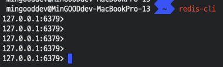
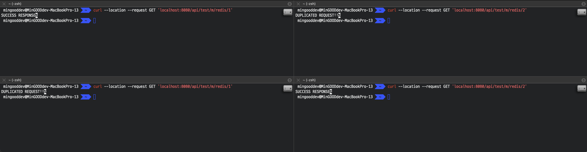

# Redis 활용 - API Lock
주로 의도하지 않은 Client의 중복 요청으로 API Lock을 걸어야하는 상황이 생기곤 한다. 
해당 비즈니스 로직이 수정, 저장의 로직이라면 이 문제를 해결해야할텐데, 
해결할 수 있는 방법은 여러가지가 있을 수 있다.
* Unique Key를 잘 설정한다.
    * save는 막을 수 있겠지만, update는 막을 수 없지 않을까? 
    * 어차피 중복 요청이고 똑같은 데이터로 update 요청이 올테니 안 막아도 될까? 
    * 막아야 할 상황도 생각해볼까?
* Redis를 사용해서 특정 API 요청이 왔을 때 그 요청을 구분할 수 있는 Key를 만들어 Redis에 넣고, 중복 요청을 막자.
    * 중복 요청이 와도, 첫번째 요청일 경우 정상적으로 비즈니스 로직을 타겠군
    * 그 다음은 중복 요청으로 판단할 수 있으니 개발자가 예외적인 로직을 처리할 수 있겠군!
        * 정말 예외를 throw 한다거나
        * 첫번째 요청과 같은 응답을 준다거나
    
---

위에서 설명한 방법 이외에 또 다른 방법이 있을 수 있어요.<br>
요청이 동시에 Controller 단에 들어오는 것 자체를 Delay를 통해 막을 수도 있겠죠? (To Be..)<br>

## MAC 기준 Redis 설치 및 실행
```text
1. brew install redis 
2. brew services start redis
3. redis-cli
```

### redis-cli


---

## Code Sample
**gradle**
```kotlin
implementation("org.springframework.boot:spring-boot-starter-data-redis")
```

**application.yml**
```yaml
spring:
  data:
    redis:
      host: 127.0.0.1
      port: 6379
```

**RedisConfig**
```kotlin
@Configuration
class RedisConfig {

    @Bean
    fun redisTemplate(redisConnectionFactory: RedisConnectionFactory): RedisTemplate<String, Any> {
        val objectMapper = ObjectMapper()
        objectMapper.disable(SerializationFeature.WRITE_DATES_AS_TIMESTAMPS)
        objectMapper.registerModules(JavaTimeModule(), Jdk8Module())

        val redisTemplate = RedisTemplate<String, Any>()
        redisTemplate.setConnectionFactory(redisConnectionFactory)
        redisTemplate.keySerializer = StringRedisSerializer()
        redisTemplate.valueSerializer = GenericJackson2JsonRedisSerializer(objectMapper)
        redisTemplate.afterPropertiesSet()
        return redisTemplate
    }

}
```

**RedisService**
```kotlin
@Service
class RedisService(private val redisTemplate: RedisTemplate<String, Any>) {

    fun setex(key: String, value: Any, expiredAt: Long, timeUnit: TimeUnit): Boolean {
        return try {
            redisTemplate.opsForValue().setIfAbsent(key, value, expiredAt, timeUnit) ?: false
        } catch (ignore: Exception) {
            false
        }
    }

    fun del(key: String): Boolean {
        return try {
            redisTemplate.delete(key)
        } catch (ignore: Exception) {
            false
        }
    }
    
}
```

**PreventDuplicatedRequestService**
```kotlin
const val REDIS_KEY_DEFAULT_LOCK_TIME_MILLIS = 1000L

@Service
class PreventDuplicatedRequestService(private val redisService: RedisService) {

    fun tryLock(lockKey: String) = redisService.setex(lockKey, "lock", REDIS_KEY_DEFAULT_LOCK_TIME_MILLIS, TimeUnit.MILLISECONDS)

    fun tryLock(lockKey: String, milliseconds: Long) = redisService.setex(lockKey, "lock", milliseconds, TimeUnit.MILLISECONDS)

    fun tryLock(lockKey: String, value: Any, milliseconds: Long) = redisService.setex(lockKey, value, milliseconds, TimeUnit.MILLISECONDS)

    fun unLock(lockKey: String) = redisService.del(lockKey)

}
```

**TestController**
```kotlin
@RestController
@RequestMapping("api/test")
class TestController(
    private val preventDuplicatedRequestService: PreventDuplicatedRequestService
) {

    private val logger = LoggerFactory.getLogger(this::class.java)

    @GetMapping("/lock/{txId}")
    fun lockTest(@PathVariable("txId") txId: Long): String {
        val lockKey = "lockKey$txId"
        if (preventDuplicatedRequestService.tryLock(lockKey).not()) {
            logger.warn("중복요청 lockKey = {}", lockKey)
            return "DUPLICATED REQUEST"
        }
        preventDuplicatedRequestService.unLock(lockKey)
        return "SUCCESS RESPONSE"
    }
}
```

---

위 코드는 읽으면 이해할 수 있는 수준이라고 생각되는데 혹시나 이해안되는 부분이 있다면 질문 ㄱㄱ<br>
그래서 이제 테스트를 하려면 동시 요청을 할 수 있어야 하는데 Jmeter와 같은 툴을 사용할 수도 있겠지만 
그냥 터미널 복제해서 curl 동시에 날리자. (Jmeter 안써봐서 그러는거 아님)

* api/test/m/redis/{txId}로 요청을 보낸다.
* lockKey는 lockKey${txId} 니까 txId별로 1개의 요청은 성공해야함
* 아래 이미지에 path가 다른건 테스트하다보니 차이가 있을뿐 이해하는데 문제없죠? ^_^


* {txId} 1, 2 각각에 대해서 한번은 SUCCESS RESPONSE // 한번은 DUPLICATED REQUEST!! 가 응답으로 온 것을 볼 수 있다.

### 끝
> 나중에 여유있을 때 Delay를 통해 Controller단 자체에 들어오지 못하는 것도 알아보도록 하자.
